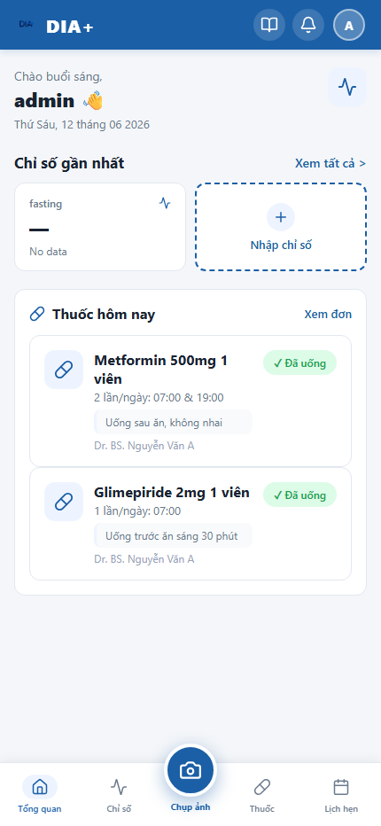
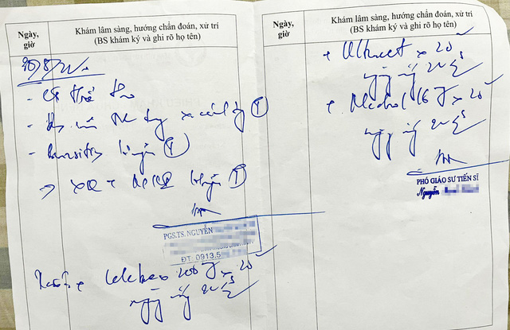

# Hướng Dẫn Sử Dụng Chi Tiết — Ứng Dụng DIA+ (IPUNI)

Chào mừng bạn đến với hướng dẫn sử dụng **DIA+ (IPUNI)** — Ứng dụng Progressive Web App (PWA) theo dõi và quản lý sức khỏe thông minh dành cho bệnh nhân tiểu đường. 

Dưới đây là cẩm nang chi tiết giúp bạn sử dụng hiệu quả toàn bộ các tính năng của ứng dụng từ giao diện chuẩn đến các tính năng AI nâng cao.

---

## 📸 Trực Quan Giao Diện (Screenshots)

Dưới đây là một số hình ảnh thực tế của ứng dụng khi hoạt động:

*Giao diện Dashboard chuẩn*

*Giao diện Dashboard Cute Mode*

*Màn hình Đăng nhập*

---

## 🔑 1. Đăng Nhập & Đăng Ký Tài Khoản

Ứng dụng hỗ trợ đăng nhập linh hoạt bằng cả **Email** hoặc số **CCCD** (Căn cước công dân).

### Tài Khoản Thử Nghiệm Mẫu:
- **Tài khoản người dùng (Plan Pro):**
  - **Email:** `khoi@example.com` hoặc **CCCD:** `000000000001`
  - **Mật khẩu:** `admin`
- **Tài khoản Quản Trị Viên (Admin Pro):**
  - **Email:** `admin@example.com` hoặc **CCCD:** `000000000002`
  - **Mật khẩu:** `admin`

### Các bước thực hiện:
1. Mở trình duyệt truy cập: `http://localhost:5173/`
2. Nhập Email hoặc CCCD cùng mật khẩu `admin`.
3. Bấm **Đăng nhập**. Hệ thống sẽ tự động chuyển hướng bạn đến màn hình Dashboard.

---

## 📊 2. Quản Lý Chỉ Số Đường Huyết (Metrics)

Theo dõi chỉ số đường huyết là cốt lõi của việc quản lý bệnh tiểu đường. DIA+ hỗ trợ phân loại trạng thái đường huyết tự động theo thời điểm đo.

### Ngưỡng Đường Huyết Quy Chuẩn (mmol/L):

| Thời Điểm Đo | Bình Thường (Normal) | Cảnh Báo (Warning) | Nguy Hiểm (Danger) | Hạ Đường Huyết (Low) |
|---|---|---|---|---|
| **Lúc đói (Fasting)** | `< 7.0` | `7.0 – 10.0` | `> 10.0` | `< 3.9` |
| **Sau ăn 2h (Post Meal)** | `< 7.8` | `7.8 – 11.1` | `> 11.1` | `< 3.9` |
| **Trước ăn (Pre Meal)** | `4.4 – 7.2` | — | `> 10.0` | `< 3.9` |
| **Trước ngủ (Pre Sleep)** | `5.0 – 8.3` | — | `> 10.0` | `< 3.9` |

### ➕ Cách Thêm Chỉ Số Mới:
1. Tại tab **Đường Huyết** hoặc trên Dashboard, bấm **Nhập chỉ số**.
2. Chọn loại thời điểm đo (Lúc đói, Sau ăn 2h, Trước ăn, Trước ngủ).
3. Nhập giá trị đường huyết (mmol/L) và ghi chú (nếu có).
4. Bấm **Lưu chỉ số**. Hệ thống sẽ hiển thị một thông báo lưu thành công màu xanh lá nổi và tự động cập nhật biểu đồ.

### 📈 Biểu Đồ Xu Hướng:
- Ứng dụng tích hợp biểu đồ trực quan (Recharts) hiển thị diễn biến đường huyết của bạn trong **7 ngày**, **14 ngày** hoặc **30 ngày**.
- Các điểm đo sẽ được hiển thị màu sắc tương ứng với mức độ an toàn (Xanh lá = Bình thường, Vàng = Cảnh báo, Đỏ = Nguy hiểm) để bạn dễ nhận biết.

---

## 💊 3. Quản Lý Đơn Thuốc (Medications)

Giúp bạn không bao giờ quên lịch uống thuốc và theo dõi chi tiết các loại thuốc được kê đơn.

### Các chức năng chính:
- **Danh sách thuốc hôm nay:** Hiển thị ngay tại màn hình chính (Dashboard) với các mốc giờ uống thuốc chi tiết. Khi đã uống, bạn chỉ cần click vào nút **Đã uống** để đánh dấu hoàn thành.
- **Quản lý đơn thuốc:** Tại tab **Thuốc**, bạn có thể:
  - Xem danh sách toàn bộ các thuốc đang sử dụng.
  - Thêm thuốc mới: Nhập tên thuốc, liều lượng, số lần uống trong ngày, chi tiết giờ uống (e.g. `07:00`, `19:00`), hướng dẫn sử dụng (uống trước hay sau ăn) và tên bác sĩ kê đơn.
  - Sửa hoặc xóa các thuốc cũ khi có chỉ định mới của bác sĩ.

---

## 🤖 4. Quét Đơn Thuốc Bằng Trí Tuệ Nhân Tạo (AI Scanning)

Đây là tính năng độc quyền giúp tự động hóa việc thêm lịch uống thuốc từ ảnh chụp đơn thuốc giấy.

### Cách thức hoạt động:
1. Vào mục **Quét Đơn Thuốc** (Scan Prescription).
2. Tải lên một ảnh chụp đơn thuốc từ thiết bị của bạn hoặc sử dụng camera.
3. Hệ thống sẽ gửi ảnh lên AI (Gemini API hoặc Anthropic Claude) để phân tích văn bản.
4. AI sẽ bóc tách các thông tin: *Tên thuốc, liều lượng, tần suất, thời gian uống, hướng dẫn sử dụng và tên bác sĩ*.
5. Sau khi quét xong, danh sách thuốc sẽ tự động được thêm vào kho dữ liệu quản lý của bạn mà không cần nhập tay.

**Giới hạn số lần quét:**
- Tài khoản **Free Plan:** Tối đa **3 lần/tháng**.
- Tài khoản **Pro Plan:** Không giới hạn số lần quét.

---

## 📅 5. Lịch Hẹn Khám Bệnh & Ghi Chú Của Bác Sĩ (Appointments)

Quản lý tất cả lịch tái khám định kỳ để việc điều trị không bị gián đoạn.

- **Đặt lịch hẹn:** Nhập tên bác sĩ, khoa khám, thời gian khám, địa điểm phòng khám và ghi chú.
- **Trạng thái lịch hẹn:** Lịch khám được phân chia rõ ràng thành: **Sắp tới (Upcoming)**, **Đã khám (Completed)**, và **Đã hủy (Cancelled)**.
- **Ghi chú của bác sĩ (Doctor Notes):** Sau mỗi buổi khám, bạn có thể lưu lại các dặn dò đặc biệt của bác sĩ vào phần ghi chú của lịch hẹn đó. Chúng sẽ được hiển thị ở mục tổng hợp riêng biệt để bạn tiện tra cứu lại bất cứ lúc nào.

---

## 💡 6. Lời Khuyên Sức Khỏe (Health Advice)

Cung cấp kho kiến thức y khoa bổ ích được phân loại theo các chủ đề:
- **Dinh dưỡng (Nutrition):** Chế độ ăn giảm tinh bột, thực phẩm nên và không nên ăn.
- **Luyện tập (Exercise):** Các bài tập nhẹ nhàng phù hợp cho người tiểu đường.
- **Xử lý khẩn cấp (Emergency):** Cách sơ cứu và xử lý nhanh khi bị tụt đường huyết đột ngột (hạ đường huyết) hoặc tăng đường huyết quá cao.

---

## ✨ 7. Chế Độ Giao Diện Dễ Thương (Cute Mode)

Để giảm bớt cảm giác căng thẳng khi theo dõi bệnh lý, DIA+ mang đến chế độ **Cute Mode** độc đáo.

### Điểm khác biệt trong Cute Mode:
- **Màu sắc chủ đạo:** Chuyển từ màu xanh biển lịch lãm sang màu tím Lavender pastel dịu nhẹ.
- **Phông chữ:** Chuyển sang phông chữ **Quicksand** bo tròn mềm mại.
- **Minh họa sinh động:** 
  - Nền hoạt họa vũ trụ chuyển động mượt mà.
  - Widget nhịp tim chú mèo dễ thương.
  - Chú mèo phi hành gia ôm viên thuốc ngộ nhìn.

### Cách kích hoạt:
1. Tại góc trên bên phải màn hình, click vào **Ảnh đại diện** của bạn để mở menu.
2. Chọn **Cài đặt**.
3. Bật công tắc **Chế độ dễ thương (Cute Mode)**.
4. Giao diện sẽ lập tức thay đổi hiệu ứng toàn bộ trang web và lựa chọn này sẽ được tự động lưu lại cho các lần truy cập sau.

---

## 🌐 8. Đa Ngôn Ngữ & Nâng Cấp Pro

- **Ngôn ngữ:** Hỗ trợ 3 ngôn ngữ: **Tiếng Việt (VI)**, **Tiếng Anh (EN)**, và **Tiếng Lào (LO)**. Bạn có thể thay đổi trong phần **Cài đặt** của ứng dụng.
- **Nâng cấp Pro Plan (49.000đ/tháng):** 
  - Mở khóa quét đơn thuốc không giới hạn.
  - Phân tích biểu đồ HbA1c xu hướng chuyên sâu.
  - Đồng bộ thiết bị đo cá nhân.
  - Nhận hỗ trợ y tế ưu tiên.
  - Thực hiện nâng cấp bằng cách mở Menu -> **Nâng cấp Pro** -> Quét mã QR thanh toán Techcombank hiển thị trên màn hình.
